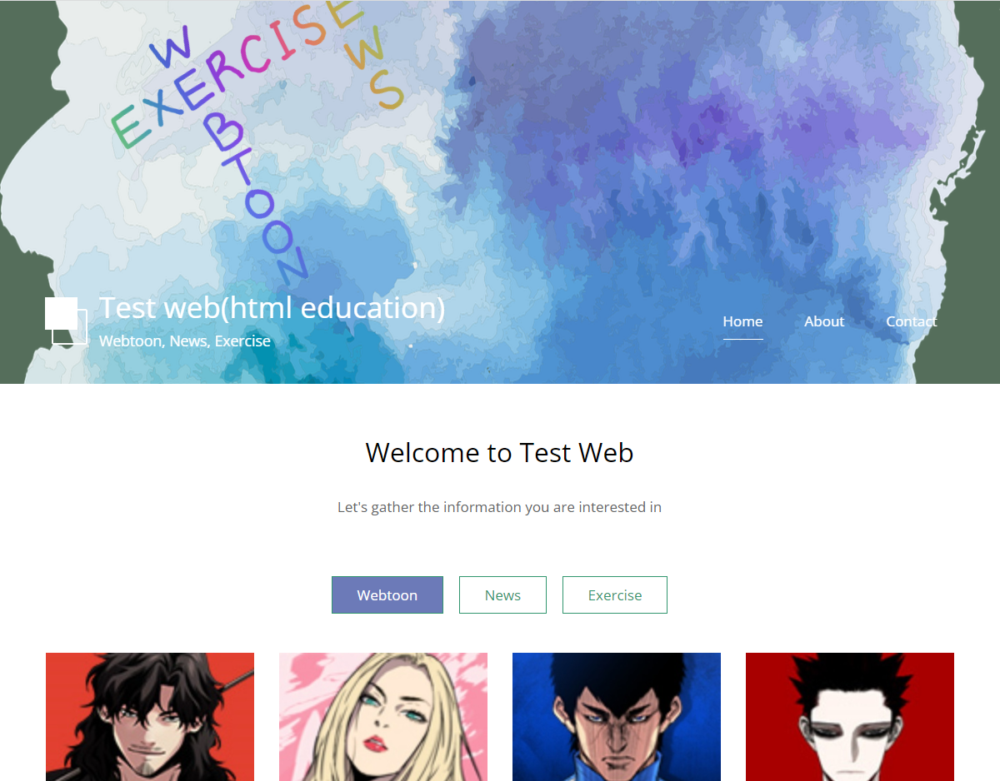

<div id="top"></div>
<!--
*** Thanks for checking out the Best-README-Template. If you have a suggestion
*** that would make this better, please fork the repo and create a pull request
*** or simply open an issue with the tag "enhancement".
*** Don't forget to give the project a star!
*** Thanks again! Now go create something AMAZING! :D
-->

<!-- PROJECT SHIELDS -->
<!--
*** I'm using markdown "reference style" links for readability.
*** Reference links are enclosed in brackets [ ] instead of parentheses ( ).
*** See the bottom of this document for the declaration of the reference variables
*** for contributors-url, forks-url, etc. This is an optional, concise syntax you may use.
*** https://www.markdownguide.org/basic-syntax/#reference-style-links
-->


<!-- PROJECT LOGO -->
<br />
<div align="center">
  <a href="https://github.com/kimdonghyeon3/Website-WEN">
    
  </a>

<h3 align="center">Health, Weebtoon, News WebSite</h3>

  <p align="center">
    운동, 웹, 뉴스 관련 모아보기 사이트
    <br />
    <a href="https://website-wen.netlify.app/index.html"><strong>View Demo »</strong></a>
    <br />
    <br />

  </p>
</div>


<!-- ABOUT THE PROJECT -->
## About The Project



웹의 기초인 Html, CSS, JavaScript를 연습하기 위한 기초 웹 페이지입니다. 운동, 뉴스, 웹툰의 정보를 모아서 확인하고 링크를 타고 들어가 해당 내용을 자세히 읽어볼 수 있습니다. 웹 페이지의 구성을 위해 About, Contact페이지를 추가해 본 기본 웹페이지 입니다.

<p align="right">(<a href="#top">back to top</a>)</p>

### Built With


<p align="right">(<a href="#top">back to top</a>)</p>

<!-- GETTING STARTED -->
## Getting Started

 본 프로젝트는 배포가 완료된 상태 입니다. Demo Link를 통해 쉽게 확인이 가능합니다.


### 설치 방법

1. Clone the repo
   ```sh
   git clone https://github.com/kimdonghyeon3/escaperoom.git
   ```
2. vscode

   download expand 'open in brower' in vscode
3. Intelij

   Live Edit Download
   and
   Download JetBrains IDE Support in Chrom market
4. Run

<p align="right">(<a href="#top">back to top</a>)</p>

<!-- USAGE EXAMPLES -->
## Usage

 웹 사이트에서는 웹툰, 뉴스, 운동 관련 정보를 카테고리 별로 모아서 볼 수 있다. 원하는 카테고리를 눌러 정보를 얻어보자.
(News, Exercise 미완)

<p align="right">(<a href="#top">back to top</a>)</p>

<!-- DEMO EXAMPLES -->
## Demo
Demo Link 
<br/>
https://website-wen.netlify.app/index.html
<br/>


<p align="right">(<a href="#top">back to top</a>)</p>

<!-- CONTACT -->
## Contact

Email - kimdonghyeon98@gmail.com

Project Link: [https://github.com/kimdonghyeon3/Website-WEN](https://github.com/kimdonghyeon3/Website-WEN)

<p align="right">(<a href="#top">back to top</a>)</p>


MIT License
Copyright (c) 2021 Othneil Drew

<!-- MARKDOWN LINKS & IMAGES -->
<!-- https://www.markdownguide.org/basic-syntax/#reference-style-links -->
[contributors-shield]: https://img.shields.io/github/contributors/github_username/repo_name.svg?style=for-the-badge
[contributors-url]: https://github.com/github_username/repo_name/graphs/contributors
[forks-shield]: https://img.shields.io/github/forks/github_username/repo_name.svg?style=for-the-badge
[forks-url]: https://github.com/github_username/repo_name/network/members
[stars-shield]: https://img.shields.io/github/stars/github_username/repo_name.svg?style=for-the-badge
[stars-url]: https://github.com/github_username/repo_name/stargazers
[issues-shield]: https://img.shields.io/github/issues/github_username/repo_name.svg?style=for-the-badge
[issues-url]: https://github.com/github_username/repo_name/issues
[license-shield]: https://img.shields.io/github/license/github_username/repo_name.svg?style=for-the-badge
[license-url]: https://github.com/github_username/repo_name/blob/master/LICENSE.txt
[linkedin-shield]: https://img.shields.io/badge/-LinkedIn-black.svg?style=for-the-badge&logo=linkedin&colorB=555
[linkedin-url]: https://linkedin.com/in/linkedin_username
[product-screenshot]: images/screenshot.png
